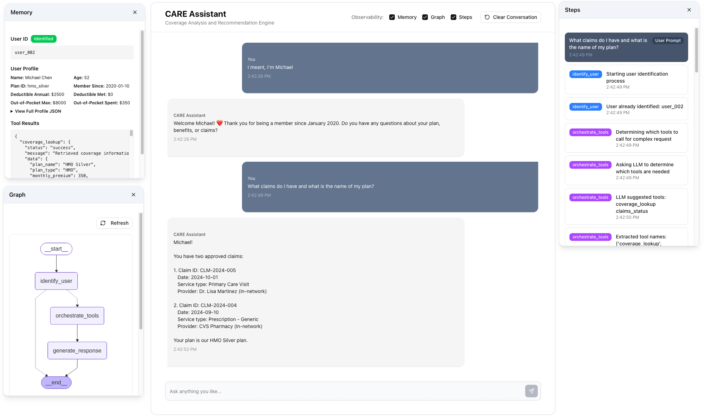

# ❤️ CARE Assistant - Coverage Analysis and Recommendation Engine




A hands-on learning application demonstrating core LangGraph concepts through a practical example: an AI-powered insurance coverage assistant that helps users understand their healthcare benefits.

To run it, just type `uv run uvicorn app.main:app --port 8000`

## 🎯 Project Goals

This is a **learning-focused POC** designed to demonstrate:
- **State management** across conversation turns
- **Tool integration** for querying insurance data
- **Intelligent tool orchestration** using LLM-based multi-tool coordination
- **Graph structure** with nodes and edges
- **Execution visibility** for understanding LangGraph internals

## 🏗️ Architecture

- **Backend**: Python 3.13 with FastAPI
- **LLM Framework**: LangGraph 1.0.1 + LangChain 1.0.2
- **Local LLM**: Ollama (llama3.3:70b-instruct-q4_K_S)
- **Observability**: LangSmith (optional cloud tracing)
- **Frontend**: Next.js 15 + TypeScript + shadcn/ui + Tailwind CSS
- **Package Management**: uv (Python) + npm (Frontend)
- **Data**: Mock JSON files (no real APIs or databases)
- **Deployment**: Static build with single-server architecture

## 📁 Project Structure

```
.
├── app/                          # Backend application code
│   ├── main.py                  # FastAPI entry point + static serving
│   ├── data/                    # Data loader module
│   │   ├── loader.py            # Data loading functions
│   │   ├── __init__.py
│   │   └── README.md            # Data documentation
│   ├── tools/                   # LangGraph tools ✅
│   │   ├── __init__.py
│   │   ├── coverage.py          # Coverage lookup tool
│   │   ├── benefits.py          # Benefit verification tool
│   │   └── claims.py            # Claims status tool
│   ├── graph/                   # LangGraph agent ✅
│   │   ├── __init__.py
│   │   ├── state.py             # State schema + first_greeting flag
│   │   ├── nodes.py             # Nodes with LLM name extraction
│   │   ├── edges.py             # Conditional routing
│   │   └── graph.py             # Graph construction
│   └── api/                     # REST API endpoints ✅
│       ├── __init__.py
│       ├── chat.py              # POST /api/chat endpoint
│       └── sessions.py          # Session management
├── frontend/                    # Next.js web application ✅
│   ├── app/                     # Next.js App Router
│   │   ├── layout.tsx           # Root layout with ErrorBoundary
│   │   ├── page.tsx             # Main chat page
│   │   └── globals.css          # Global styles
│   ├── components/              # React components
│   │   ├── chat/                # Chat UI components
│   │   │   ├── ChatWindow.tsx
│   │   │   ├── ChatHeader.tsx
│   │   │   ├── MessageList.tsx
│   │   │   ├── MessageInput.tsx
│   │   │   └── ThinkingIndicator.tsx
│   │   ├── observability/       # Draggable observability windows
│   │   │   ├── DraggableMemoryWindow.tsx
│   │   │   ├── DraggableGraphWindow.tsx
│   │   │   ├── DraggableStepsWindow.tsx
│   │   │   ├── MemoryContent.tsx
│   │   │   ├── GraphContent.tsx
│   │   │   └── ExecutionStepsContent.tsx
│   │   ├── ui/                  # shadcn/ui components
│   │   └── ErrorBoundary.tsx
│   ├── lib/                     # Utilities
│   │   ├── api.ts               # API client
│   │   ├── types.ts             # TypeScript interfaces
│   │   └── utils.ts             # Helper functions
│   ├── out/                     # Static build output (production)
│   ├── next.config.ts           # Next.js configuration
│   ├── package.json             # Frontend dependencies
│   └── tsconfig.json            # TypeScript configuration
├── tests/                       # Test files
│   ├── test_ollama.py          # Ollama integration test
│   └── test_agent.py           # Interactive CLI
├── .cody/                       # Cody Framework
│   ├── config/
│   │   ├── commands/           # Custom slash commands
│   │   ├── scripts/
│   │   └── templates/
│   └── project/
│       ├── plan/               # Planning documents
│       │   ├── prd.md
│       │   ├── plan.md
│       │   └── workflow_diagram.mmd
│       ├── build/              # Version build artifacts
│       │   ├── feature-backlog.md
│       │   ├── v0.1.0-environment-foundation/
│       │   ├── v0.2.0-core-agent/
│       │   ├── v0.3.0-web-interface/
│       │   ├── v0.4.0-observability-enhancements/
│       │   ├── v0.5.0-ui-improvements-ai-chatbot/
│       │   ├── v0.6.0-move-data-folder-to-root/
│       │   ├── v0.6.1-code-cleanup-and-graph-view/
│       │   └── v0.7.0-move-observability-to-popup/  # ✅ Current version
│       │       ├── design.md
│       │       ├── tasklist.md
│       │       └── retrospective.md
│       └── library/
│           ├── assets/
│           └── docs/           # Documentation
│               ├── langgraph-agent-architecture.md
│               └── release-notes.md
├── data/                        # Mock JSON data files (root level)
│   ├── user_profiles.json      # User insurance profiles
│   ├── insurance_plans.json    # Plan types and coverage
│   └── claims_data.json        # Claims history
├── .venv/                       # Python virtual environment (ignored)
├── node_modules/                # npm dependencies (ignored)
└── README.md                    # This file
```

## 🚀 Getting Started

### Prerequisites

Before you begin, ensure you have:
- ✅ Python 3.10 or higher
- ✅ [uv](https://github.com/astral-sh/uv) package manager installed
- ✅ [Ollama](https://ollama.ai/) installed and running
- ✅ Ollama model: `llama3.3:70b-instruct-q4_K_S` or `llama3.2:latest`

**Optional (for enhanced observability):**
- ⭐ [LangSmith](https://smith.langchain.com/) account (free tier) - See [LangSmith Setup Guide](.cody/project/library/docs/langsmith-setup.md)

### Installation

**1. Clone or navigate to the project directory**
```bash
cd care-assistant
```

**2. Create and activate virtual environment**
```bash
# Create virtual environment with uv
uv venv

# Activate (macOS/Linux)
source .venv/bin/activate
```

**3. Install dependencies**
```bash
# Install core dependencies (v1.0+)
uv pip install langgraph langchain langchain-ollama langchain-community

# Install web framework
uv pip install fastapi uvicorn

# Install observability (includes LangSmith + environment variable support)
uv pip install langsmith python-dotenv
```

**Note**: This project uses LangChain 1.0.2 and LangGraph 1.0.1 (stable releases). The installation commands above will automatically install the latest 1.x versions.

**4. (Optional) Configure LangSmith**

If you want cloud-based tracing and observability:

```bash
# Copy the environment template
cp .env.example .env

# Edit .env and add your LangSmith API key
# Get your key from https://smith.langchain.com/
```

See the complete [LangSmith Setup Guide](.cody/project/library/docs/langsmith-setup.md) for detailed instructions.

**The app works perfectly without LangSmith** - it's an optional feature for enhanced observability.

**5. Verify Ollama is running**
```bash
# Check Ollama service
ollama list

# Should show llama3.3:70b-instruct-q4_K_S or llama3.2:latest
```

**5. Test the installation**
```bash
# Test Ollama integration
python tests/test_ollama.py

# Test the full agent (v0.2.0+)
python tests/test_agent.py

# Should show successful connection and LLM responses
```

## 🏃 Running the Application

### Prerequisites

Before running, ensure you have:
1. **Ollama running** with the model:
   ```bash
   ollama serve
   # In another terminal, verify:
   ollama list  # Should show llama3.3:70b-instruct-q4_K_S
   ```

2. **Dependencies installed** (see Installation section below)

### Production Mode (Recommended)

Run the full application with the modern web UI:

```bash
# Start the server (serves both API and static frontend)
uv run uvicorn app.main:app --port 8000

# Open in browser
http://localhost:8000/
```

**What you get:**
- Modern chat interface with ❤️ CARE Assistant branding
- Natural language name input ("I'm Sarah" works!)
- Personalized welcome messages with member history
- Real-time progress messages during tool execution
- Three draggable observability windows (Memory, Graph, Execution Steps) - toggle via checkboxes in header
- Session persistence across browser refreshes

### Development Mode (For Frontend Development)

Run backend and frontend separately with hot-reload:

**Terminal 1 - Backend:**
```bash
uv run uvicorn app.main:app --reload --port 8000
```

**Terminal 2 - Frontend:**
```bash
cd frontend
npm run dev
```

**Then open:** http://localhost:3000/

**Benefits:**
- Instant UI updates when editing React components
- Better error messages and dev tools
- TypeScript checking in real-time

### CLI Mode (Testing/Development)

Test the LangGraph agent directly via command line:

```bash
python tests/test_agent.py
```

**Available Commands:**
- Type your questions naturally
- `trace` - Show last turn's execution trace
- `state` - Display current state summary
- `clear` - Start a fresh conversation
- `quit` - Exit

### API Endpoints

The backend provides these endpoints:

- **POST /api/chat** - Main chat endpoint (used by frontend)
  ```bash
  curl -X POST http://localhost:8000/api/chat \
    -H "Content-Type: application/json" \
    -d '{"session_id": null, "message": "Hello"}'
  ```

- **GET /health** - Health check
  ```bash
  curl http://localhost:8000/health
  ```

- **GET /api/graph** - Returns graph visualization as PNG image

- **GET /** - Serves the frontend (production mode)
  - Open in browser: http://localhost:8000/

### Using Observability Windows

The application includes three draggable windows for inspecting the agent's behavior:

**To open windows:**
1. Look for the checkboxes in the chat header (Observability section)
2. Check the boxes for the windows you want to view:
   - **Memory** - View current conversation state, user profile, and tool results
   - **Graph** - See the visual LangGraph structure
   - **Steps** - Watch the execution trace as the agent processes messages

**Window features:**
- **Draggable** - Click and drag the header to reposition anywhere on screen
- **Stackable** - Click any window to bring it to the front
- **Real-time updates** - All windows update live as you chat
- **Default closed** - Windows are hidden by default for a clean interface

## 💬 Example Conversations (v0.2.0)

### Simple Question - Single Tool
```
👤 You: Sarah
🤖 Agent: Hi Sarah! I found your profile. You're enrolled in the PPO Gold plan.
         How can I help you today?

👤 You: Do I have any pending claims?
🤖 Agent: Looking at your claims history, you have 1 pending claim:
         - Physical Therapy ($250, submitted 2024-02-20)

         You also have 2 approved claims and no denied claims.

   (This turn: 3 trace entries | Type 'trace' to see details)
```

### Complex Multi-Intent Question - Multiple Tools
```
👤 You: What plan do I have, how long have I been a member, what does it cover, and do I have outstanding claims?

🤖 Agent: Great questions! Let me give you a comprehensive overview:

**Your Plan:**
You're enrolled in the PPO Gold plan, which is a Preferred Provider Organization plan.

**Membership:**
You've been a member since March 15, 2022 - that's almost 3 years now!

**Coverage:**
Your PPO Gold plan includes comprehensive coverage for:
- Primary care and specialist visits
- Hospital stays and surgeries
- Prescription medications
- Preventive care at 100% coverage
- Physical therapy and rehabilitation
- Mental health services

Annual deductible: $1,500 (you've met $800 so far)
Out-of-pocket maximum: $6,000 (you've spent $2,100)

**Outstanding Claims:**
You have 1 pending claim:
- Physical Therapy: $250 (submitted February 20, 2024)

Is there anything specific about your coverage you'd like me to explain?

   (This turn: 9 trace entries | Type 'trace' to see details)

👤 You: trace
================================================================================
EXECUTION TRACE - LAST TURN ONLY (9 entries)
================================================================================

[1] Node: identify_user
    Action: User already identified: user_001

[2] Node: orchestrate_tools
    Action: Determining which tools to call for complex request

[3] Node: orchestrate_tools
    Action: LLM suggested tools: coverage_lookup
benefit_verify
claims_status

[4] Node: orchestrate_tools
    Action: Executing tool: coverage_lookup

[5] Node: orchestrate_tools
    Action: Tool coverage_lookup completed

[6] Node: orchestrate_tools
    Action: Executing tool: benefit_verify

[7] Node: orchestrate_tools
    Action: Tool benefit_verify completed

[8] Node: orchestrate_tools
    Action: Executing tool: claims_status

[9] Node: orchestrate_tools
    Action: Tool claims_status completed

[10] Node: generate_response
    Action: Generating response with all tool results
================================================================================
```

### General Conversation - No Tools
```
👤 You: Thank you so much for your help!
🤖 Agent: You're very welcome, Sarah! I'm here whenever you need help
         understanding your insurance coverage, benefits, or claims.
         Feel free to ask me anything!

   (This turn: 4 trace entries | Type 'trace' to see details)
```

### Verify Data Loading

When the server starts, you should see:
```
🚀 Starting CARE Assistant - Coverage Analysis and Recommendation Engine...
📚 Version 0.3.0 - Web Interface
📂 Loading mock data...
  ✓ Loaded 3 user profiles
  ✓ Loaded 3 insurance plans
  ✓ Loaded 9 claims records
✅ Application startup complete!
```

## 📚 Mock Data

The application uses mock insurance data to demonstrate LangGraph concepts:

- **3 User Profiles**: Diverse scenarios (individual, family, different plan types)
- **3 Insurance Plans**: PPO Gold, HMO Silver, EPO Bronze
- **9 Claims Records**: Mix of approved, pending, and denied claims

Data files are located in the [data/](data/) folder at the project root.

## 🧪 Testing

### Test Ollama Integration

```bash
python tests/test_ollama.py
```

This verifies:
- ✅ LangChain can connect to Ollama
- ✅ llama3.3:70b model responds correctly
- ✅ Insurance-related prompts work

### Verify Dependencies

```bash
python -c "
import langgraph
import langchain
import langchain_community
import fastapi
import uvicorn
import pydantic
print('✅ All imports successful!')
"
```

### Check Installed Packages

```bash
uv pip list
```

## 📖 Learning Path

This project is structured for progressive learning:

### ✅ Version 0.1.0 - Environment & Foundation
- Virtual environment setup
- Dependency installation
- Project structure
- Mock data creation
- Basic FastAPI server
- Ollama integration verification

### ✅ Version 0.2.0 - Core Agent (Completed)
- LangGraph state schema with message history and execution tracing
- Three tools: coverage lookup, benefit verification, claims status
- Graph nodes with **intelligent tool orchestration**
  - `identify_user`: Conversational name-based user lookup
  - `orchestrate_tools`: LLM-based multi-tool coordinator
  - `generate_response`: Natural language response synthesis
- **Multi-intent handling** - Automatically calls multiple tools for complex questions
- Eliminates manual intent classification - LLM intelligently selects tools
- Interactive CLI with execution trace visualization
- Comprehensive documentation and inline comments

### ✅ Version 0.3.0 - Web Interface (Completed)
**All 58 tasks completed successfully!**

- **Modern Web UI** - Next.js 15 + TypeScript + shadcn/ui components
- **REST API** - FastAPI backend with session management
- **LLM-Powered Features:**
  - Smart name extraction (handles "I'm Marcelo, your patient" → "Marcelo")
  - Personalized welcome: "Welcome Sarah! ❤️ Thank you for being a member since March 2022..."
  - First greeting flag to prevent LLM override
- **Real-Time Feedback:**
  - Progress messages during tool execution
  - Loading indicators
  - Error handling and recovery
- **Observability Tools:**
  - Execution steps with user prompt grouping
  - Memory (state) inspection panel
  - System initialization tracking
  - Tool results display
  - Bottom panel with tabs (later replaced by draggable windows in v0.7.0)
- **Session Management:**
  - In-memory backend storage
  - localStorage frontend persistence
  - Automatic cleanup of expired sessions
  - Session survives browser refresh
- **Production Deployment:**
  - Static build (Next.js → `/frontend/out`)
  - Single-server architecture (FastAPI serves everything)
  - No separate frontend server needed
- **UX Features:**
  - ❤️ CARE Assistant branding
  - Auto-scrolling messages
  - Clear conversation button
  - Keyboard shortcuts (Enter to send)
  - User/AI message styling

### ✅ Version 0.4.0 - Observability Enhancements (Completed)
- **Rebranded Panel:** "Developer Panel" → "Observability" with 🔍 icon
- **Better Terminology:** "State" → "Memory", "Execution Trace" → "Execution Steps"
- **Enhanced Tab Styling:** Active tabs with dark gray background and white text
- **User Prompt Display:** See your messages alongside execution steps with darker background
- **Smart Grouping:** Trace entries grouped by the message that triggered them, latest first
- **System Initialization:** Clear visual indicator for initial startup traces
- **Tool Results Fix:** Memory tab now properly displays tool results (was showing empty before)

### ✅ Version 0.5.0 - UI Improvements AI Chatbot (Completed)
- **Contained Chat Layout:** Gray rounded border wraps entire chat window
- **Modernized Input Field:** Redesigned input with light gray background and integrated send button
- **Enhanced Message Bubbles:** Custom rounded corners with cleaner appearance
- **Thinking Indicator:** Animated three-dot bubble during AI processing
- **Optimized Spacing:** Proper padding throughout for balanced layout
- **Improved Colors:** Better contrast and readability

### ✅ Version 0.6.0 - Move Data Folder to Root (Completed)
- **Root-Level Data Folder:** Created `/data` folder at project root for all JSON files
- **Cleaner Project Structure:** Clear separation between code and data files
- **Updated Path Resolution:** Modified loader.py for cleaner path navigation
- **Zero Breaking Changes:** Public API remains unchanged

### ✅ Version 0.6.1 - Code Cleanup and Graph View (Completed)
- **Graph Visualization:** Added `/api/graph` endpoint for PNG visualization
- **Code Cleanup:** Removed 3 legacy node implementations (163 lines)
- **Improved Routing:** Fixed static file routing for Next.js export
- **Better Maintainability:** Reduced nodes.py from 803 to 640 lines

### ✅ Version 0.7.0 - Move Observability to Pop-up Windows (Current)
**Latest version with enhanced observability UX!**

- **Three Draggable Windows:** Memory (400×500px), Graph (400×600px), Steps (400×700px)
- **Checkbox Controls:** Toggle windows on/off via checkboxes in chat header
- **Centered Opening:** All windows open centered over chat for optimal visibility
- **Fully Draggable:** No bounds restrictions - drag windows anywhere
- **Z-Index Management:** Click any window to bring it to front
- **Real-time Updates:** All windows update live as conversation progresses

### 🔄 Version 1.0.0 - Enhanced Learning Features (Planned)
- Conditional routing demonstrations
- State persistence across turns
- Comprehensive code documentation
- Extension guide for adding new tools/nodes

## 🛠️ Development

### Key Files to Understand

1. **[app/main.py](app/main.py)** - FastAPI application and startup logic
2. **[app/data/loader.py](app/data/loader.py)** - Data loading and query functions
3. **[tests/test_ollama.py](tests/test_ollama.py)** - Ollama integration testing

### Adding Code

All application code lives in the `app/` directory:
- Use type hints throughout
- Add docstrings to functions
- Follow PEP 8 conventions
- Keep learning focus (extensive comments)

### Running Tests

```bash
# Run Ollama test
python tests/test_ollama.py

# Future: Run all tests
# pytest tests/
```

## 🐛 Troubleshooting

### Virtual Environment Issues

**Problem:** `source .venv/bin/activate` fails
```bash
# Make sure you're in the project directory
pwd

# Should show: .../care-assistant

# Try with explicit path
source ./.venv/bin/activate
```

### Ollama Connection Issues

**Problem:** Test fails to connect to Ollama
```bash
# Check Ollama is running
ollama list

# If not running, start it (depends on installation method)
# Then verify model is available
ollama pull llama3.3:70b-instruct-q4_K_S
```

### Import Errors

**Problem:** Modules not found
```bash
# Ensure virtual environment is activated
source .venv/bin/activate

# Verify packages are installed
uv pip list | grep -E "(langgraph|langchain|fastapi)"

# Reinstall if needed
uv pip install langgraph langchain langchain-community fastapi uvicorn
```

### Server Won't Start

**Problem:** FastAPI server fails to start
```bash
# Check for syntax errors
python -m py_compile app/main.py

# Try running directly
python -m uvicorn app.main:app

# Check port isn't already in use
lsof -i :8000
```

### LangSmith Issues

**Problem:** "LangSmith tracing disabled" message

**Solution:**
1. Check `.env` file exists in project root
2. Verify `LANGCHAIN_TRACING_V2=true` (not "false")
3. Restart the app after changes

**Problem:** No traces in LangSmith dashboard

**Solution:**
1. Verify API key is correct in `.env`
2. Check project name: `LANGCHAIN_PROJECT=care-assistant`
3. Ensure internet connection is working
4. See [LangSmith Setup Guide](.cody/project/library/docs/langsmith-setup.md) for details

**Problem:** Don't see token counts in terminal

**Solution:** This is normal! Ollama doesn't expose token counts in responses. However, **LangSmith tracks them automatically** via callbacks. You can see token usage in the LangSmith dashboard for each trace.

**Note:** The app includes offline resilience - if LangSmith can't connect (no internet, invalid key), it logs a warning and continues working normally.

## 📝 Documentation

- **Project Planning**: [.cody/project/plan/](./cody/project/plan/)
  - [discovery.md](.cody/project/plan/discovery.md) - Initial requirements gathering
  - [prd.md](.cody/project/plan/prd.md) - Product requirements
  - [plan.md](.cody/project/plan/plan.md) - Implementation plan
  - [workflow_diagram.mmd](.cody/project/plan/workflow_diagram.mmd) - System architecture

- **Build Tracking**: [.cody/project/build/](.cody/project/build/)
  - [feature-backlog.md](.cody/project/build/feature-backlog.md) - All versions and features
  - [release-notes.md](.cody/project/build/release-notes.md) - Comprehensive release history
  - [v0.8.0-add-langsmith-observability/](.cody/project/build/v0.8.0-add-langsmith-observability/) - Current version docs

- **Observability**: [.cody/project/library/docs/](.cody/project/library/docs/)
  - [langsmith-setup.md](.cody/project/library/docs/langsmith-setup.md) - Complete LangSmith setup guide

- **Mock Data**: [app/data/README.md](app/data/README.md) - Data schemas and usage

## 🤝 Contributing

This is a learning project! Feel free to:
- Experiment with the code
- Add new tools or nodes
- Create additional mock data scenarios
- Extend the functionality

## 📄 License

This is an educational project for learning LangGraph concepts.

## 🙏 Acknowledgments

- **LangGraph** - For the amazing agent framework
- **LangChain** - For LLM abstractions
- **FastAPI** - For the web framework
- **Ollama** - For local LLM inference
- **Cody Framework** - For structured development approach

---

**Built with ❤️ for learning LangGraph**

*Generated with [Claude Code](https://claude.com/claude-code)*
